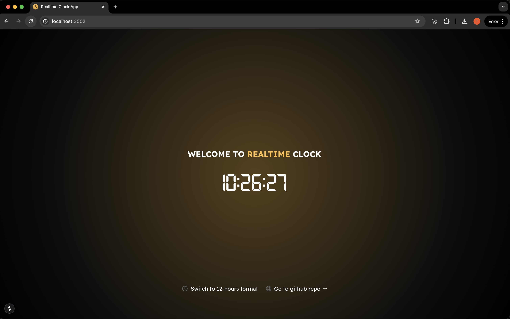

# README.md

# Next Realtime Clock App

This project is a Next.js application that displays the current time in real-time using WebSockets.

## App Preview




## Project Structure

```
next-realtime-clock-app
├── public
│   └── fonts
|   └── icons
|── src
|   ├── app
│   |    ├── page.tsx
|   |    ├── favicon.ico
|   |    └── layout.tsx
|   ├── components
|   │   └── Footer.tsx
|   ├── styles
│   |   └── globals.css
|   ├── utils
│   |   └── index.ts
|   ├── hooks
│       └── useSocket.ts
├── package.json
├── tsconfig.json
├── postcss.config
├── tailwind.config
├── tsconfig.json
├── README.md
└── yarn.lock
```

## Setup Instructions

1. Clone the repository:
    ```
    git clone <repository-url>
    cd realtime-clock-app
    ```

2. Install packages:
    ```
    yarn install
    ```

3. Run the application:
    ```
    yarn dev
    ```

## Usage

- The WebSocket server emits the current time every second.
- The application displays the current time in real-time on the main page.
